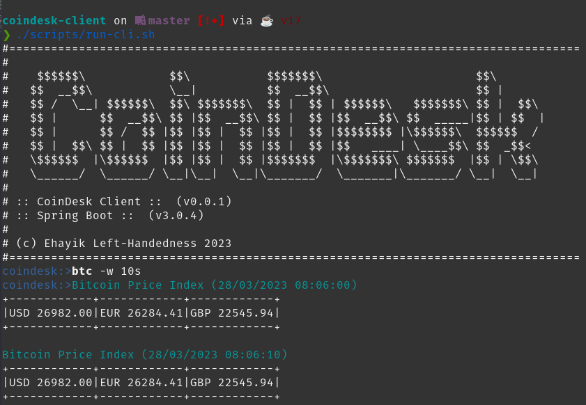

# CoinDesk Client

[](https://www.gnu.org/licenses/gpl-3.0)

CLI Application for watching the Bitcoin Price Index (BPI) in real-time, developed with Spring Shell library.



## How to install

1. Clone the repository: `git clone git@github.com:ehayik/coindesk-client.git`
2. Build project: `./gradlew build`

Now you can run it by executing the following command:

```bash
./scripts/run-cli.sh 
```
## How to use

```bash
btc # display bitcoin price index (USD, EUR, GBP) once.

btc -w 0 # display bitcoin price index (USD, EUR, GBP) once.
```

```bash
btc -w 10s # display bitcoin price index (USD, EUR, GBP), with a 10 seconds refresh rate:
           ## - ns for nanoseconds
           ## - us for microseconds
           ## - ms for milliseconds
           ## - s for seconds
           ## - m for minutes
           ## - h for hours
           ## - d for days
           
stop btc # stop displaying the bitcoin price index.
```

## Credits

I learned a lot from the projects and resources listed below:

- [Developing CLI application with Spring Shell Series](https://medium.com/agency04/developing-cli-application-with-spring-shell-part-1-807cd3a32461) by [Domagoj Madunić](https://www.linkedin.com/in/domagoj-maduni%C4%87-7980751/)
- [WireMock Spring Boot](https://github.com/maciejwalkowiak/wiremock-spring-boot) by [Maciej Walkowiak](https://maciejwalkowiak.com/)
- [Spring Boot Integration Tests With WireMock and JUnit 5](https://rieckpil.de/spring-boot-integration-tests-with-wiremock-and-junit-5/) by [Philip Riecks](https://twitter.com/rieckpil)
- [Spring Shell Reference Documentation](https://docs.spring.io/spring-shell/docs/current/reference/htmlsingle/#_what_is_spring_shell)
- [Declarative Clients in Spring](https://www.youtube.com/watch?v=3NcmlrumSOc) by [Olga Maciaszek-Sharma](https://www.linkedin.com/in/olgamaciaszek/?originalSubdomain=pl)
- [JSR 354: Money and Currency: Moneta Reference Implementation](https://github.com/JavaMoney/jsr354-ri)
- [Java Money and the Currency API](https://www.baeldung.com/java-money-and-currency) by [Baeldung](https://www.baeldung.com/author/baeldung)
- [Spring WebClient and long-polling](https://stackoverflow.com/questions/62445591/spring-webclient-and-longpolling) by [David](https://stackoverflow.com/users/537738/david)